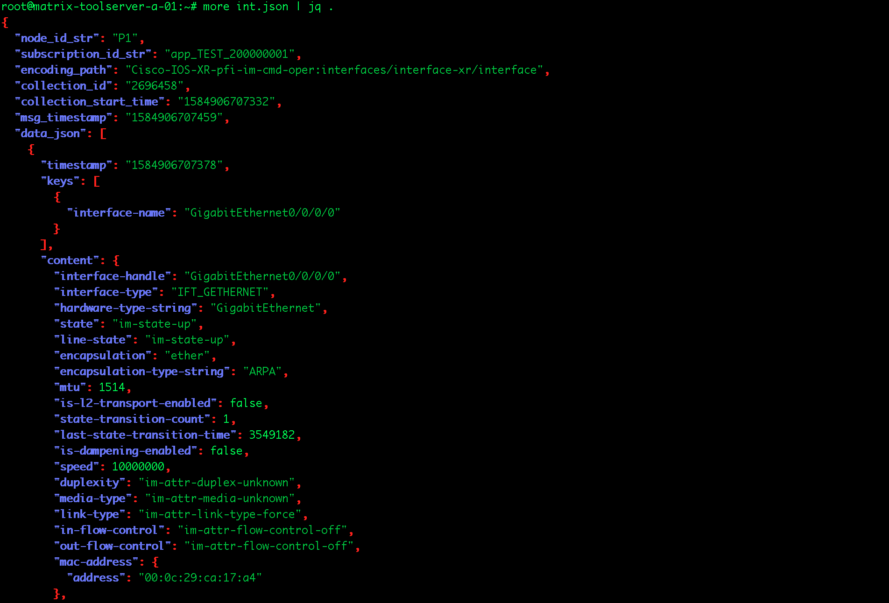

# Cisco has a list of tools to help identify and explore ios-xr sensor paths.

### 1. Github
  Go here: [Github](https://github.com/YangModels/yang/tree/master/vendor/cisco/xr) and browse models for specific release. 
  Note: Telemetry only cares about operational *-oper.yang models, not *–cfg.yang, not *–act.yang.
  
### 2. PYANG
  Download the interested yang model to a linux server. 
  Use pyang to see the content of the model, kind of similar to snmpwalk.
  Compare names in the command you want to capture and the output of the YANG model
  
  Following is an example to view the tree structure of interface stats yang model. 
  
  ```console
  pyang -f tree Cisco-IOS-XR-infra-statsd-oper.yang --tree-path infra-statistics/interfaces/interface/latest/generic-counters
 
module: Cisco-IOS-XR-infra-statsd-oper
   +--ro infra-statistics
      +--ro interfaces
         +--ro interface* [interface-name]
            +--ro latest
               +--ro generic-counters
                  +--ro packets-received?                    uint64
                  +--ro bytes-received?                      uint64
                  +--ro packets-sent?                        uint64
                  +--ro bytes-sent?                          uint64
                  +--ro multicast-packets-received?          uint64
                  +--ro broadcast-packets-received?          uint64
<output snipped for brevity>
```

### 3. Advanced NETCONF Explorer 
This is a graphical explorer for YANG models supported by a NETCONF device or service orchestrator. Features include:

 Retrieve all YANG models supported by a device.
 Parse the YANG models and outputting a tree with all the nodes which can expand / collapse.
 
    
 Filter the model tree by module name and searching the names and descriptions of the YANG nodes in it.
 
 
    
 Browsing and searching live (operational) data for selected YANG models.
 
    
Download [Advanced NETCONF Explorer - ANX](https://github.com/cisco-ie/anx) code. 
Note: This tool is meant to explore yang models on a lab device. DO NOT run this tool against a production devices!

### 4. Telemetry Data Mapper 

[Telemetry Data Mapper - TDM](https://github.com/cisco-ie/tdm) to map data identifiers from SNMP, gRPC, NETCONF, CLI, etc. to each other.

TDM provides an offline, immutable view into advertised data availability from data models, with search affordance to quickly identify data of interest and the capability to map between data to aid in keeping track of what is roughly equivalent to what.

### 5. CLI

This is a manual process and SHOULD NOT run on production devices. The first step is to understand which “show output” you want to stream using Model Driven Telemetry. Let’s say we want to find the right path for RSVP interface output:  
```console
RP/0/RP0/CPU0:NCS5501_bottom#sh rsvp interface bundle-ether 26   
Thu Dec  7 18:27:56.646 PST

*: RDM: Default I/F B/W % : 80% [cfgd] (max resv/bc0), 0% [default] (bc1)

Interface                 MaxBW (bps)  MaxFlow (bps) Allocated (bps)      MaxSub (bps) 
------------------------- ------------ ------------- -------------------- -------------
Bundle-Ether26                   240G           240G           20M (  0%)            0 
```

After the “show output” was defined you need to find the corresponding XML schema inside the router, using “schema-describe” command:
```console
RP/0/RP0/CPU0:NCS5501_bottom#schema-describe sh rsvp interface bundle-ether 26
Thu Dec  7 18:28:25.325 PST
Action: get
Path:   RootOper.RSVP.InterfaceBrief({'InterfaceName': 'Bundle-Ether26'})
```

After you found the corresponding XML schema, go and check the content of it. To do this you need to run “m2mcon” and use “get”:


At this step you have your show output, the schema you need and the fields of this schema. You need to find corresponding YANG model. Do this search based on the name (usually, it is clear which model you need), for RSVP you have just a single model: “Cisco-IOS-XR-ip-rsvp-oper.yang”

Use pyang tool to go through the model, try to find the path (section) that contains the same fields. In our case it will be:  


We can also use the following command to retrieve live data on a device under test for validation:
```console
run mdt_exec -s <sensor-path> -c <candence> 
```


All the counters on the screen are in JSON format. To see in a more human-readable format, use any preferred JSON formatter, e.g:



