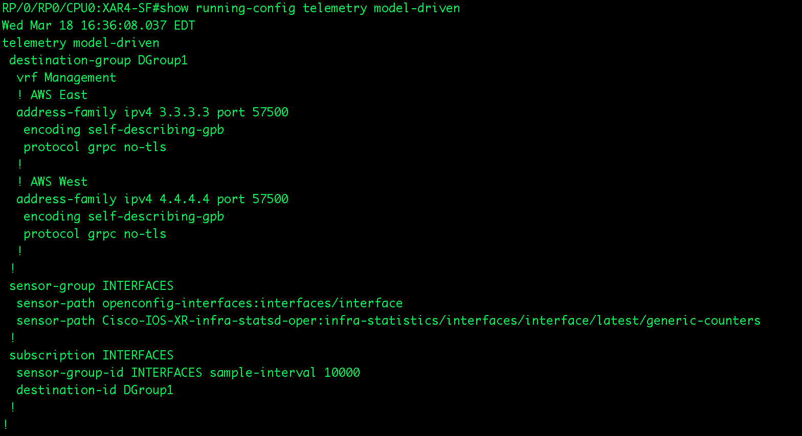
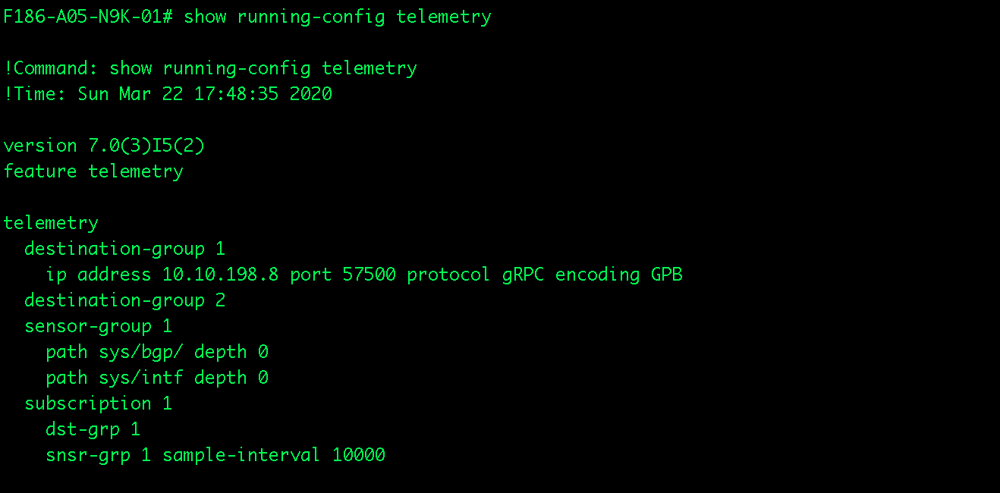
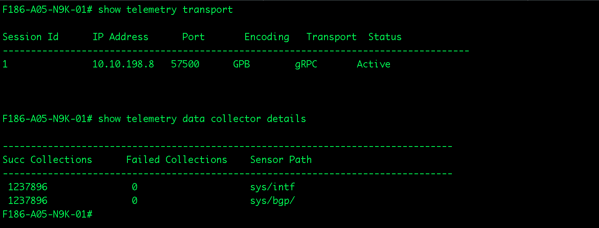

# Configure Streaming Telemetry Sensor-Path on Cisco Devices
### All streaming telemetry configuration has the following three component:
    1. Sensor group - the data model that needs to be streamed out
    2. Destination group - where the data is streaming to (collection system), how the data is streamed (encoding and transport)
    3. Subscription - how often does the device push the data out - regularly based on configured interval, or on change

### 1. IOS-XR Configuration and Validation

    Note: The example shows here has two destination for redundancy purpose to avoid data loss. At the collection end, the data needs to be deduped. The sample-interval is in ms unit.
##### Check the status of destination, sensor-path to ensure destination is active, and sensor-paths are resolved.

### 2. IOS-XE

### 3. NX-OS

    Note: Although the encoding used in the example config here is GPB, it is actually refer to GPBKV or self-describe GPB as in IOS-XR. Users need to make sure to select matching encoding on the collector side. 
